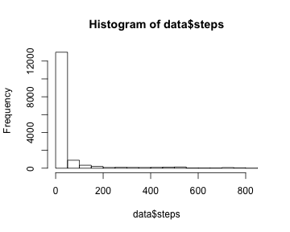
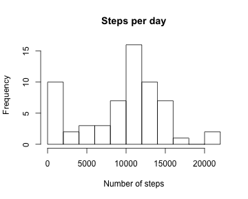
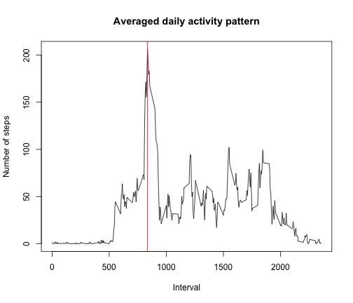
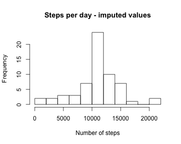
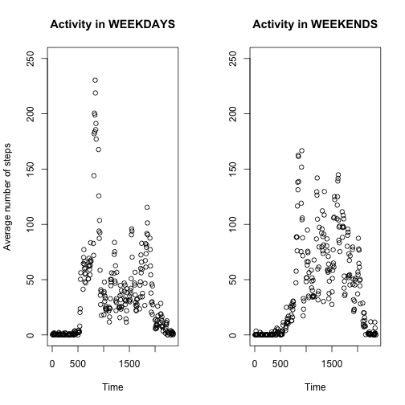

Reproducible Research: Peer Assessment 1 
====================================================

The **main objective** of this assessment is to explore the activity patterns of an anonymous individual by making use of data from a personal activity monitoring device. To do so, I will:
- Load data
- Process or transform data
- Calculate descriptive statistics for the number of steps
- Deal with missing values
- Examine differences between weekdays and weekends

1. Loading and preprocessing the data
-------------------------------------
First of all, I have *forked* the repository in https://github.com/rdpeng/RepData_PeerAssessment1. Then, I have *cloned* that same repository from my GitHub account to my computer. Then I have worked locally. The most important thing now is to indicate which is my working directory (*i.e.* where I have stored my local repository). In my case: 


```r
setwd("/Users/marielainsua/Documents/PROFESIONAL/INSTITUCIONES_Y_DOCUMENTACION/Coursera/Reproducible_Research/a1/RepData_PeerAssessment1")
```
Obviously, this will be different for you. Once the working directory is known, I employed the following code to read the data:


```r
zipdir = "./activity"
dir.create(zipdir)
unzip("./activity.zip", exdir=zipdir)
file = paste(zipdir, list.files(zipdir)[1], sep="/")
data <- read.csv(file)
```

It is interesting to take a look to the data to know if everything goes OK:

```r
head(data)
```

```
##   steps       date interval
## 1    NA 2012-10-01        0
## 2    NA 2012-10-01        5
## 3    NA 2012-10-01       10
## 4    NA 2012-10-01       15
## 5    NA 2012-10-01       20
## 6    NA 2012-10-01       25
```

```r
dim(data)
```

```
## [1] 17568     3
```

```r
hist(data$steps)
```

 

The variable *steps* seems to be highly skewed. However, at this stage of the analyses it is not so important, so I did not aply any transformation or pre-processing at this point.


2. What is mean total number of steps taken per day?
--------------------------------------------------
The following code can perform the task:

```r
days = unique(data$date)
steps.per.day <- numeric(length(days))
names(steps.per.day) <- days
for(i in days)
      steps.per.day[i] <- sum(data[data$date == i,"steps"], na.rm=T)

mean.steps = mean(steps.per.day, na.rm=T)
mean.steps
```

```
## [1] 9354
```

```r
median.steps = median(steps.per.day, na.rm=T)
median.steps
```

```
## [1] 10395
```

Therefore, the mean number of steps per day is **9354**, and the median number of steps per day is **10395**, although there is a significant amount of NA values that may hide relevant information. The distribution of the number of steps per day is:


```r
hist(steps.per.day, main="Steps per day", breaks=10, xlab="Number of steps")
```

 

Interestingly, the distribution of the number of steps per day is almost normal, and by far less skewed than the number of steps per 5-minutes periods. It may be useful to have this in mind regarding further analyses that may require normal-like distributions. 


3. What is the average daily activity pattern?
-------------------------------------------
In this section of the assignment, we are required to do two things:

1. Make a time series plot of the 5-minute interval (x-axis) and the average number of steps taken, averaged across all days (y-axis).

2. Indicate which 5-minute interval, on average across all the days in the dataset, contains the maximum number of steps?

To fulfil both requirements, it is useful to calculate the average number of steps, for each 5-minute interval. By the moment we do not how much information is lost (*i.e.*: is NA), so it seems advisable to record the number of steps per each interval *per day*:

```r
intervals <- unique(data$interval)
m <- matrix(NA, nrow=length(intervals), ncol=length(days), dimnames=list(intervals, days))

for(i in 1:length(intervals))
      for(j in 1:length(days)) {
            interval = intervals[i]
            day = days[j]
            n.steps <- data[data$date == day & data$interval == interval,"steps"]
            if(length(n.steps)>0) m[as.character(interval), as.character(day)] <- mean(n.steps, na.rm=T)
            }

m[1:5, 1:5] # to take a look 
```

```
##    2012-10-01 2012-10-02 2012-10-03 2012-10-04 2012-10-05
## 0         NaN          0          0         47          0
## 5         NaN          0          0          0          0
## 10        NaN          0          0          0          0
## 15        NaN          0          0          0          0
## 20        NaN          0          0          0          0
```

Then it is easier to average across days for a given 5-minutes interval:

```r
steps.per.interval <- rowMeans(m, na.rm=T)
```

The daily pattern, then, would be like this:

```r
plot(x=as.numeric(names(steps.per.interval)), y=steps.per.interval, type="l", main="Averaged daily activity pattern", xlab="Interval", ylab="Number of steps")

peak = as.numeric(names(steps.per.interval)[which(steps.per.interval==max(steps.per.interval, na.rm=T))])
abline(v=peak, col=2)
```

 

The most active 5-minutes interval, in average, is the inverval **835**, which corresponds, approximately, to the **14 hours**.


4. Imputing missing values
------------------------
There are a number of days/intervals where there are missing values (coded as NA). The presence of missing days may introduce bias into some calculations or summaries of the data. For that reason, we are asked to do several things.

First, we calculate  and report the total number of missing values in the dataset:

```r
sum(is.na(data$steps))
```

```
## [1] 2304
```

This corresponds roughly to **13%** of the data. We could  fill in all of the missing values in the dataset. Since we are not asked to employ fancy strategies, I just re-use the data previously calculated, and imput the average for that interval:


```r
steps.imputed <- data$steps
names(steps.imputed) <- rownames(data)
for(i in 1:length(steps.per.interval)){
      interval = names(steps.per.interval)[i]
      rows <- rownames(data)[data$interval == interval]
      rows.of.gaps <- rows[is.na(data[rows, "steps"])]
      steps.imputed[rows.of.gaps] <- steps.per.interval[interval]
}

sum(is.na(steps.imputed)) # must be 0
```

```
## [1] 0
```

```r
data2 <- data # makes a copy
data2$steps <- steps.imputed # force imputed values into the copy of the data
```

To explore the impact of imputing missing data on the estimates of the total daily number of steps, we are asked to repeat some of the previous calculations, so I re-use the code that I employed in Section 2, using the new *data2* object with imputed values, instead of the original *data*:


```r
days2 = unique(data2$date)
steps.per.day2 <- numeric(length(days2))
names(steps.per.day2) <- days2
for(i in days2)
      steps.per.day2[i] <- sum(data2[data2$date == i,"steps"], na.rm=T)

mean.steps2 = mean(steps.per.day2, na.rm=T)
mean.steps2
```

```
## [1] 10766
```

```r
median.steps2 = median(steps.per.day2, na.rm=T)
median.steps2
```

```
## [1] 10766
```

Now the mean number of steps per day is **10766**, and the median number of steps per day is **10766**. The distribution of the number of steps per day is:


```r
hist(steps.per.day2, main="Steps per day - imputed values", breaks=10, xlab="Number of steps")
```

 

Overall there is not a huge impact in the data, but the distribution is almost perfectly symmetrical, which may be a good thing.


5. Are there differences in activity patterns between weekdays and weekends?
-------------------------------
To answer this question, I added a factor variable with two levels -- "weekday" and "weekend".


```r
weekdays <- weekdays(as.POSIXlt(data2$date))

# In my case, it returns the names of the weekdays in Spanish. To avoid problems, I make the code un-explicit:
working.days <- unique(weekdays)[1:5]
relaxing.days <- unique(weekdays)[6:7]
weekdays[weekdays %in% working.days] <- "weekday"
weekdays[weekdays %in% relaxing.days] <- "weekend"
table(weekdays) # it seems reasonable
```

```
## weekdays
## weekday weekend 
##   12960    4608
```

```r
data2 <- data.frame(data2, weekdays)
```

Finally, I create the required plot for the averaged daily activity pattern for weekdays and weekends separatedly. Since now I have imputed values, I take a slightly different approach than before:


```r
sub.work <- data2[weekdays=="weekday",]
sub.relax <- data2[weekdays=="weekend",]
intervals <- unique(data2$interval)
activity.work <- activity.relax <- rep(NA, times=length(intervals))
names(activity.work) <- names(activity.relax) <- intervals
for(i in 1:length(intervals)){
      interval = intervals[i]
      steps.work <- sub.work[sub.work$interval == interval, "steps"]
      steps.relax <- sub.relax[sub.relax$interval == interval, "steps"]
      activity.work[interval] <- mean(steps.work, na.rm=T)
      activity.relax[interval] <- mean(steps.relax, na.rm=T)
}

#hist(activity.work)
#hist(activity.relax)

par(mfrow=c(1,2))

# I have problems when using type="l", I do not know why...
#plot(activity.work, main="Activity in WEEKDAYS", type="l", xlab="Time", ylab="Average number of steps", ylim=c(0, 250))
#plot(activity.relax, main="Activity in WEEKENDS", type="l", xlab="Time", ylab="", ylim=c(0, 250))

plot(activity.work, main="Activity in WEEKDAYS", type="b", xlab="Time", ylab="Average number of steps", ylim=c(0, 250))
plot(activity.relax, main="Activity in WEEKENDS", type="b", xlab="Time", ylab="", ylim=c(0, 250))
```

 

We can see that in weekends there is more physical activity and more evenly distributed during the whole day, without the 14 h. peak that is the main characteristic of the weekdays pattern.
